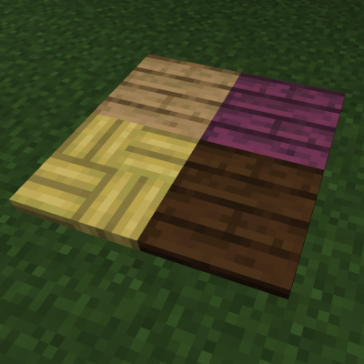

# Wood Floor

A Fabric mod for Minecraft 1.21.11 that adds decorative wooden flooring blocks in all vanilla wood variants.

## Features

- **13 Wood Floor Variants**: One for each vanilla wood type
- **Flat Design**: Thin flooring blocks for interior decoration
- **Burnable**: Like other wood blocks, floors can catch fire

### Available Floors

**Overworld Woods:**
- Oak Floor
- Spruce Floor
- Birch Floor
- Jungle Floor
- Acacia Floor
- Dark Oak Floor
- Mangrove Floor
- Cherry Floor
- Pale Oak Floor
- Bamboo Floor
- Bamboo Mosaic Floor

**Nether Woods:**
- Crimson Floor
- Warped Floor

## Screenshots

## Crafting

Craft wood floors from their corresponding planks.

## Installation

1. Install [Fabric Loader](https://fabricmc.net/use/) for Minecraft 1.21.11
2. Download and install [Fabric API](https://modrinth.com/mod/fabric-api)
3. Download the latest release of Wood Floor
4. Place the jar file in your `mods` folder

### Server-Side Installation

This mod works on servers with vanilla clients! When installed on a server:
- Vanilla clients will be prompted to download a resource pack
- If accepted, they see custom floor textures
- If declined, gameplay features still work

Polymer is bundled with the mod - no additional downloads required.

## Requirements

- Minecraft 1.21.11
- Fabric Loader 0.18.1+
- Fabric API
- Polymer (bundled)

## License

This project is licensed under the MIT License - see the [LICENSE](LICENSE) file for details.
